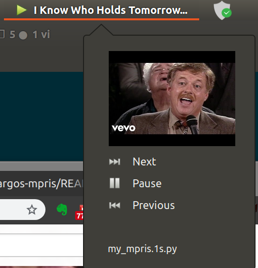

# argos-mpris
Show mpris playing information (e.g. YouTube being played in Chrome) in gnome menu bar via [argos](//github.com/p-e-w/argos).



# Installation

1. Install plugin [browser-mpris2](//github.com/otommod/browser-mpris2) for Chrome. Refer to [this post](https://www.linuxuprising.com/2018/08/add-youtube-player-controls-to-your.html).
2. Install GNOME Shell extension [argos](//github.com/p-e-w/argos).
3. Place file [my_mpris.1s.py](my_mpris.1s.py) into `~/.config/argos` directory and make it executable:
    ```bash
    chmod +x ~/.config/argos/my_mpris.1s.py
    ```

# References

1. Argos: https://github.com/p-e-w/argos
2. Argos-mpris for spotify: https://github.com/giedriusStan/argos-mpris
3. Install brower-mpris2: https://www.linuxuprising.com/2018/08/add-youtube-player-controls-to-your.html
4. browser-mpris2: https//github.com/otommod/browser-mpris2
5. DBUS Tutorial: https://dbus.freedesktop.org/doc/dbus-python/tutorial.html
6. DBUS Example: https://stackoverflow.com/questions/32335350/dbus-send-version-in-python
7. DBUS Tutorial https://www.linuxjournal.com/article/10455
